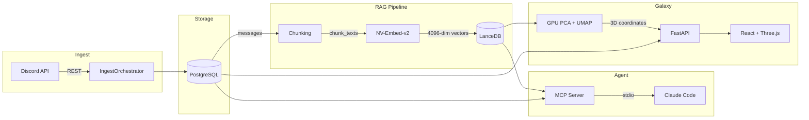

# Discord Archive

Archive Discord servers to PostgreSQL, build a semantic search index with NV-Embed-v2 + LanceDB, and explore them through an MCP retrieval agent or a 3D galaxy visualizer.

## Architecture


```mermaid
graph LR
    subgraph Ingest
        A[Discord API] -->|REST| B[IngestOrchestrator]
    end

    subgraph Storage
        B --> C[(PostgreSQL)]
    end

    subgraph RAG Pipeline
        C -->|messages| D[Chunking]
        D -->|chunk_texts| E[NV-Embed-v2]
        E -->|4096-dim vectors| F[(LanceDB)]
    end

    subgraph Agent
        F --> G[MCP Server]
        C --> G
        G -->|stdio| H[Claude Code]
    end

    subgraph Galaxy
        F --> I[GPU PCA + UMAP]
        I -->|3D coordinates| J[FastAPI]
        C --> J
        J --> K[React + Three.js]
    end
```

Four layers, each runnable independently:

| Layer | Entry point | Purpose |
|-------|------------|---------|
| **Ingest** | `python -m discord_archive.ingest` | Download Discord data to PostgreSQL |
| **RAG** | `python -m discord_archive.rag.chunking` | Chunk messages, embed with NV-Embed-v2, store in LanceDB |
| | `python -m discord_archive.rag.embedding` | |
| **Retrieval** | via Claude Code (`.mcp.json`) | MCP server with semantic search + SQL tools |
| **Galaxy** | `python -m discord_archive.rag.projection` | Project embeddings to 3D, serve via FastAPI + React |
| | `python -m discord_archive.galaxy` | |

## Setup

**Requirements:** Python >= 3.11, Docker

```bash
cp .env.example .env     # edit with your PostgreSQL credentials
docker compose up -d     # start PostgreSQL

uv sync                  # core only (ingest)
uv sync --extra rag      # + RAG pipeline and MCP server
uv sync --extra galaxy   # + 3D visualization
```

Copy `config.example.json` to `config.json` and fill in your database URL and Discord tokens.

## Ingest

Downloads guilds, channels, roles, messages, attachments, reactions, emojis, stickers, and scheduled events. Supports historical backfill and incremental sync with per-channel checkpoints.

```bash
python -m discord_archive.ingest                          # all configured guilds
python -m discord_archive.ingest --guild-id 123           # specific guild
python -m discord_archive.ingest --channel-id 456         # specific channel
python -m discord_archive.ingest -v                       # verbose logging
```

Rate limits are handled automatically (429 → wait, 5xx → exponential backoff, 403 → skip channel). Interrupted runs resume from checkpoint.

## RAG Pipeline

Three-stage pipeline that turns messages into searchable vector embeddings:

1. **Chunking** — Groups messages into semantic chunks using three strategies (sliding window, author group, reply chain). Token-aware boundaries.

2. **Embedding** — Encodes chunks with [NV-Embed-v2](https://huggingface.co/nvidia/NV-Embed-v2) (4096-dim, L2-normalized). Batched by token budget to maximize GPU throughput.

3. **Storage** — Vectors stored in LanceDB with metadata (guild, channel, authors, timestamps) for filtered ANN search.

```bash
python -m discord_archive.rag.chunking                    # create chunks
python -m discord_archive.rag.embedding                   # encode to vectors
```

Both commands accept `--guild-id` and `--channel-id` filters.

## Retrieval (MCP Server)

A [FastMCP](https://github.com/jlowin/fastmcp) server that exposes the archive to Claude Code as three tools:

| Tool | Description |
|------|-------------|
| `semantic_search` | Vector similarity search with filters (guild, channel, author, date range) |
| `sql_query` | Read-only SQL against PostgreSQL (auto-appends LIMIT 500) |
| `refresh_attachment_url` | Refresh expired Discord CDN signed URLs via Discord API |

Registered in `.mcp.json` and auto-started by Claude Code. Lazy-loads the embedding model on first search.

## Galaxy

3D semantic visualization of the archive:

1. **Projection** — GPU PCA (4096 → 200) then UMAP (200 → 3D). Exports per-guild binary point clouds.
2. **Server** — FastAPI serving projection data, chunk details, and search API.
3. **Frontend** — React + Three.js with custom GLSL shaders for point rendering and GPU picking.

```bash
python -m discord_archive.rag.projection                  # compute 3D coordinates
python -m discord_archive.galaxy                          # start web server (port 8000)
```

## Project Structure

```
discord_archive/
├── config/              # Pydantic settings
├── core/                # BaseOrchestrator
├── db/
│   ├── models/          # SQLAlchemy ORM (15 tables)
│   └── repositories/    # Data access layer
├── ingest/              # Discord API → PostgreSQL
├── rag/
│   ├── chunking/        # Messages → semantic chunks
│   ├── embedding/       # NV-Embed-v2 + LanceDB
│   ├── projection/      # GPU PCA + UMAP → 3D
│   └── retrieval/       # MCP server
├── galaxy/              # FastAPI web server
└── utils/               # Snowflake, permissions, logging
web/                     # React + Three.js frontend
```

## License

MIT
